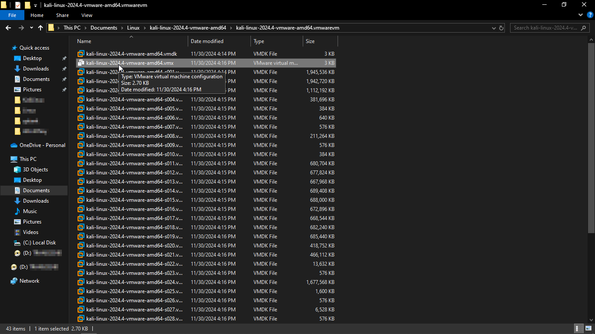
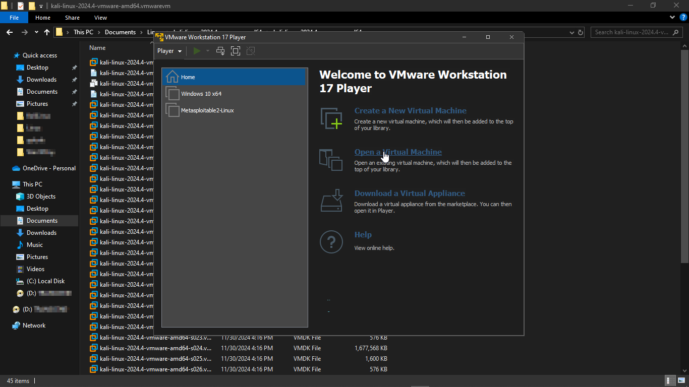

# Cybersecurity Home Lab Documentation (Part 1 of 3)

This repository documents my journey setting up a cybersecurity home lab using **Windows 10 Tiny** and **Kali Linux** on **VMware**, running on my **ThinkPad X260** with **8GB RAM** and a **256GB SSD**. This is Part 1 of a 3-part series, and I'll be updating it with more advanced configurations in later parts.

## Table of Contents

- [Overview](#overview)
- [Prerequisites](#prerequisites)
- [Setup Instructions](#setup-instructions)
  - [Installing VMware Workstation Player](#installing-vmware-workstation-player)
  - [Setting Up the Virtual Machines](#setting-up-the-virtual-machines)
    - [Windows 10 Tiny VM](#windows-10-tiny-vm)
    - [Kali Linux VM](#kali-linux-vm)
  - [Optimizing VMware Settings](#optimizing-vmware-settings)
- [Future Enhancements](#future-enhancements)
- [Contributing](#contributing)
- [License](#license)
- [Contact](#contact)

## Overview

This project demonstrates how to build a lightweight cybersecurity home lab using consumer-grade hardware. The focus is on achieving smooth performance with limited resources by using a stripped-down version of Windows (Windows 10 Tiny) and Kali Linux as a penetration testing platform—all virtualized with VMware Workstation Player.

  
Lab Setup Overview

  

## Prerequisites

Before starting, ensure you have:
- **Hardware:** ThinkPad X260 with 8GB RAM and 256GB SSD, Intel Core i5 Processor, or equivalent.
- **Software:** 
  - [VMware Workstation Player](https://www.vmware.com/products/workstation-player.html)
  - Windows 10 Tiny ([Host OS image or VM file](https://archive.org/details/tiny11-2311))
  - Kali Linux VM file (download from the [official Kali website](https://www.kali.org/get-kali/))

## Setup Instructions

### Installing VMware Workstation Player
1. Download and install VMware Workstation Player from the official website.
2. Follow the on-screen instructions and reboot your system after installation.

  
<strong>VMware Installation</strong>

  

### Setting Up the Virtual Machines

#### Windows 10 Tiny VM
1. Open VMware and click **Open a Virtual Machine**.
2. Select your Windows 10 Tiny VM file.
3. **Allocate 3GB of RAM** to Windows 10 Tiny. *(I was surprised at how smoothly it ran with this limited allocation.)*
4. Configure storage and network settings as needed.

  
📷 Windows 10 Tiny Installation Steps (Click to Expand)

   ## Windows VM Settings

 

  
Open the VMware Workstation Player and create a new virtual machine

  
 

 

  
Navigate to the Windows 10 Tiny ISO file and select it

  
 

 

  
Input a name for the virtual machine

  
 

 

  
Make sure the network adapter is set to NAT (Network Address Translation) and click OK

  
 

 

  
Click on finish to save

  
 

 

  
It will take some time to create the virtual machine

  
 

 

  
Start the virtual machine

  
 

 

  
The machine will boot up

  
 

 

  
Make your selections and click on next

  
 

 

  
Windows will install

  
 

 

  
Select your region

  
 

 

  
Create a username & password

  
 

 

  
Create a username & password

  
 

 

  
Disable unnecessary settings

  
 

 

  
Windows will take a few minutes to boot, take a break!

  
 

 

  
Windows has successfully booted!

  
 

 

#### Kali Linux VM
1. Open the Kali Linux VM file in VMware.
2. **Allocate 4GB of RAM** and **2 processor cores** to Kali Linux.
3. Finish setting up by adjusting storage and network settings.

  
📷 Kali Linux Installation Steps (Click to Expand)

 

  
Search for Kali Linux

  
 

 

  
Enter the Kali website

  
 

 

  
Navigate to the VMware image file

  
 

 

  

    Download 7-zip (<a href="https://www.7-zip.org/download.html" target="_blank" style="color: yellow;">7-zip</a>)
  

 

 

  
Extract the VM file downloaded from Kali Linux

  
 

 

  
Navigate to the extracted folder

  
 

 

  
Make sure a file with the extension (.vmx) is present

  
 

 

  
Open the VMware Workstation Player

  
 

 

  
Create a new virtual machine, then navigate to the .vmx file and select it

  
 

 

  
Navigate to the virtual machine settings and increase the RAM to 4GB

  
 

 

  
Start the virtual machine & select the first option

  
 

 

  
Default username & password is kali/kali

  
 

 

  
You are logged in!

  
 

 

### Optimizing VMware for Performance
- **Enable VT-x/AMD-V in BIOS:** Ensure virtualization is enabled.
- **Resource Allocation:** Fine-tune RAM and CPU settings between host and guest OS.
- **Network Settings:**  
  - **NAT:** Provides security by hiding the VM behind the host’s IP. *(Recommended for isolation.)*  
  - **Bridged Networking:** Use if the VM needs its own IP for direct communication.  

## Future Enhancements

✅ **Future Documentation Updates:**
- [ ] 🔜 Part 2: [SIEM Integration](./SIEM%20Integration.md)
- [ ] 🔜 Part 3: Automating SOC Processes with Python & Bash (Coming Soon!)

## Contributing

Contributions are welcome! If you have improvements or additional insights, please open an issue or submit a pull request.

## License

This project is licensed under the MIT License. See the [LICENSE](LICENSE) file for details.

## Contact

For questions or suggestions, please open an issue or contact me via GitHub or on my X page.

Happy hacking—and have fun learning!
