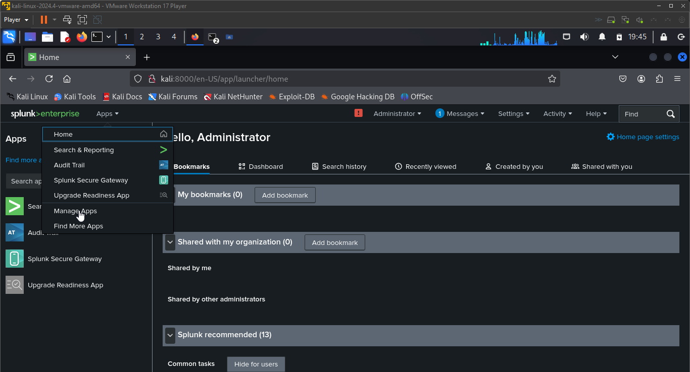

# Cybersecurity Home Lab Documentation (Part 2 of 3) SIEM Lab with Splunk, Sysmon, and Universal Forwarder

This repository provides a step-by-step guide to set up a Security Information and Event Management (SIEM) lab using Splunk Enterprise on Linux, Splunk Universal Forwarder on Windows, and Sysmon for enhanced Windows logging. It also covers troubleshooting tips, configuration details, and installing the Splunk Add-On for Microsoft Sysmon.

---

## Table of Contents

- [Overview](#overview)
- [Prerequisites](#prerequisites)
- [Lab Environment Setup](#lab-environment-setup)
- [Setting Up Splunk Enterprise on Linux](#setting-up-splunk-enterprise-on-linux)
- [Configuring Splunk Universal Forwarder on Windows](#configuring-splunk-universal-forwarder-on-windows)
  - [Inputs Configuration](#inputs-configuration)
  - [Outputs Configuration](#outputs-configuration)
- [Installing and Configuring Sysmon on Windows](#installing-and-configuring-sysmon-on-windows)
- [Installing Splunk Add-On for Microsoft Sysmon on Linux](#installing-splunk-add-on-for-microsoft-sysmon-on-linux)
- [Viewing and Searching Logs](#viewing-and-searching-logs)
- [Troubleshooting](#troubleshooting)
- [Conclusion](#conclusion)

---

## Overview

This guide details the process of creating a SIEM lab environment using:
- **Splunk Enterprise** as the log indexer (running on Linux)
- **Splunk Universal Forwarder (UF)** on a Windows machine for log collection
- **Sysmon** to generate detailed Windows event logs
- **Splunk Add-On for Microsoft Sysmon** on the Splunk Enterprise server to enhance parsing and field extractions for Sysmon events

  
SIEM Integration Diagram

  

---

## Prerequisites

- **Linux Machine:** Installed with Splunk Enterprise.
- **Windows Machine:** Installed with Splunk Universal Forwarder and Sysmon.
- **Virtualization Software:** VMware, VirtualBox, or similar, if using VMs.
- **Basic Knowledge:** Familiarity with command-line interfaces, editing configuration files, and Splunk administration.

---

## Lab Environment Setup

1. **Networking:**  
   Ensure both your Linux Splunk server and Windows UF can communicate.  
   - If on the same host (via VMware), you can use `127.0.0.1` or the Linux VM’s internal IP.
   - Open port `9997` on the Linux server for receiving data.

  
Check if the Port is Listening

  

OR

  

If the output shows a process listening on port 9997, it’s enabled.

2. **Firewall:**  
   Configure firewalls on both machines to allow:
   - **Linux:** TCP traffic on port `9997`
   - **Windows:** Outbound traffic on port `9997`

**Linux**

  
Check Firewall Rules Using iptables (Linux Default Firewall)

  

Add a rule if a rule for port 9997 is not present:

  

**Windows**

  
Verify Listening Port on Windows

  

If you see a line with the state LISTENING, the port is active.

Check Windows Firewall:

- Open Windows Defender Firewall with Advanced Security.
- Inbound Rules:
Look for a rule allowing inbound traffic on port 9997. If it’s missing, create a new inbound rule:
- Rule Type: Port
- Protocol: TCP
- Port: 9997
- Action: Allow the connection
- Profile: (Domain, Private, Public) as needed
- Name: e.g., "Splunk Indexer Port 9997"

---

## Setting Up Splunk Enterprise on Linux

1. **Download and Install Splunk Enterprise:**

  
Download Splunk with Bash

  

  
Splunk Download in Progress

  

2. **Install Splunk**

  
Install Splunk

  

3. **Enable and Start Splunk:**

  
Enable Splunk

  

  
Start Splunk

  

4. **Configure Data Receiving:**
- In Splunk Web (http://<LINUX_IP>:8000), navigate to **Settings > Forwarding and Receiving**.

  
Setting up Receiver

  

- Click **Add New** under Receiving and set the port to 9997.

  
Add Port to Receiving

  

- Restart Splunk if necessary:

  
Restart Splunk

  

5. **Verify Listening Port:**

  
Confirm Port is Listening After Installation

  

---

## Installing and Configuring Sysmon on Windows

1. **Download Sysmon**  
   Get it from the [Microsoft Sysinternals Website](https://docs.microsoft.com/en-us/sysinternals/downloads/sysmon).

2. **Extract and Run Sysmon:**
   - Extract the ZIP to a folder (e.g., `C:\Sysinternals\Sysmon`).
   - Open an elevated Command Prompt, navigate to that folder:

  
Open Command Prompt in Administrator Mode and Run Sysmon

  

- You should see an output confirming Sysmon is installed and started.

3. **Verify Sysmon Logs:**
   - Open Event Viewer and navigate to **Applications and Services Logs > Microsoft > Windows > Sysmon**.

  
Confirm Sysmon is Active in the Event Viewer

  

---
## Configuring Splunk Universal Forwarder on Windows
The Splunk Universal Forwarder (UF) is a lightweight agent that collects and forwards log data to the Splunk Enterprise server.

### Inputs Configuration

1.Install the UF:
- Download the installer from the [Splunk website](https://www.splunk.com/en_us/download/universal-forwarder.html#) and install it on your Windows machine.

NB: During the installation proccess,you can leave the e area blank but make sure to set the Receiving Indexer to the IP of your linux machine.

2. **Create/Edit** inputs.conf:
- Path: C:\Program Files\SplunkUniversalForwarder\etc\system\local\inputs.conf

Use a text editor (like Notepad) to create or edit the file with the following configuration for Windows Event Logs and Sysmon logs:

Create/Edit "inputs.conf" File

3. **Obtain Windows Hostname:**

Obtain Windows Machine Hostname

### Outputs Configuration

1. **Create/Edit** outputs.conf:
- Path: C:\Program Files\SplunkUniversalForwarder\etc\system\local\outputs.conf

- Use the Notepad to create a normal .txt file then save it to the path above as a .conf file once done with the editing.

- Configuration for Windows Event Logs and Sysmon logs:

  
Create/Edit "Outputs.conf" File

  

Replace <LINUX_SPLUNK_IP> with your Linux Splunk server’s actual IP address (or use 127.0.0.1 if applicable).

2. **Restart the Forwarder:**

Restart the Forwarder

---

## Installing Splunk Add-On for Microsoft Sysmon on Linux Using Splunk Web

1. **Log in to Splunk Web on your Linux server.**

Login to Splunk Web

2. **Navigate to Apps > Manage Apps.**

Manage Apps

3. **Search for and Install the Splunk Add-On for Microsoft Sysmon.**

Install Add-On

## Viewing and Searching Logs

After installing and configuring Splunk Enterprise, Universal Forwarder, Sysmon, and the Sysmon Add-On, it’s time to verify that data is flowing correctly by viewing and searching logs within the Splunk Web interface. This section explains how to perform searches, create dashboards, and troubleshoot common issues.

### 1. Accessing Splunk Web

- **Log In:**  
  Open your browser and navigate to the Splunk Enterprise Web UI at:

  http://<LINUX_IP>:8000

  Replace `<LINUX_IP>` with the IP address of your Linux Splunk server.

- **Dashboard Overview:**  
Once logged in, you’ll see the Splunk dashboard with the Search & Reporting app. This is your primary interface for running searches and viewing logs.

Splunk Home Page

### 2. Basic Search Techniques

Splunk uses the Search Processing Language (SPL) to filter and analyze log data.

- **View All Logs:**  
To see all events indexed in the default index (`main`), run:

index=main

Index View

- **Filter by Sourcetype:**  
To specifically view Sysmon logs forwarded from Windows:

index=sysmon sourcetype=XmlWinEventLog source="WinEventLog:Microsoft-Windows-Sysmon/Operational"

  
Sourcetype Filter

  

- **Filter by Host:**  
If you have logs coming from multiple hosts, narrow down your search:

index=main host="YOUR_WINDOWS_HOSTNAME" 

  
Host Filter

  

- **Using Time Ranges:**  
Use the time picker (upper right corner) to select a time range (e.g., "Last 15 minutes," "Last 24 hours," etc.) to focus on recent events.

  
Splunk Search Page

  

### 3. Advanced Search Techniques

- **Keyword Searches:**  
To search for specific keywords (e.g., "malware", "suspicious", "PowerShell"):

index=main "suspicious"

- **Field-Based Filtering:**  
If the Sysmon Add-On is installed, field extractions should be available. For example:

---

## Troubleshooting

[Go to Troubleshooting Guide](./Troubleshooting.md)

---

## Conclusion

By following this documentation, you'll establish a robust SIEM lab environment. The Windows machine collects detailed event logs using Sysmon and forwards them via the Splunk Universal Forwarder to your Splunk Enterprise server on Linux. The Splunk Add-On for Microsoft Sysmon further enriches the events, enabling enhanced security analysis and more effective threat detection.

*Happy log hunting!*
