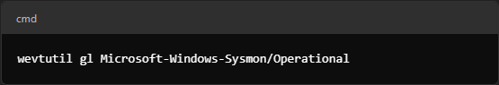
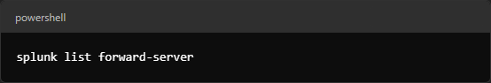

# Troubleshooting Sysmon Logs Issues with Splunk Universal Forwarder

This document provides a step-by-step, elimination-style guide to troubleshoot and resolve issues where Sysmon logs are not appearing in Splunk. Follow each step, test your results, and move on if the issue persists.

---

## Table of Contents

1. [Introduction](#introduction)
2. [Step 1: Verify Sysmon Log Generation on Windows](#step-1-verify-sysmon-log-generation-on-windows)
3. [Step 2: Check and Update Sysmon Configuration](#step-2-check-and-update-sysmon-configuration)
4. [Step 3: Configure Splunk Universal Forwarder Inputs](#step-3-configure-splunk-universal-forwarder-inputs)
5. [Step 4: Grant Required Permissions to Access Sysmon Logs](#step-4-grant-required-permissions-to-access-sysmon-logs)
6. [Step 5: Verify Forwarder-to-Indexer Connection](#step-5-verify-forwarder-to-indexer-connection)
7. [Step 6: Ensure the Sysmon Index Exists in Splunk](#step-6-ensure-the-sysmon-index-exists-in-splunk)
8. [Step 7: Restart Services and Verify Operation](#step-7-restart-services-and-verify-operation)
9. [Step 8: Final Verification in Splunk Web UI](#step-8-final-verification-in-splunk-web-ui)
10. [Additional Troubleshooting and Next Steps](#additional-troubleshooting-and-next-steps)
11. [Conclusion](#conclusion)

---

## Introduction

This guide details an elimination-style troubleshooting process for fixing issues that prevent Sysmon logs from appearing in Splunk. We start from verifying that Sysmon is logging on the Windows host, proceed to check the Splunk Universal Forwarder (UF) configuration, grant necessary permissions, verify connectivity between the forwarder and the indexer, and finally confirm data in Splunk Web UI.

---

## Step 1: Verify Sysmon Log Generation on Windows

1. Open **PowerShell as Administrator** and run:
   ```powershell
   Get-WinEvent -LogName "Microsoft-Windows-Sysmon/Operational" -MaxEvents 5

2. Expected Outcome:
    You should see Sysmon events (e.g., Process Create events with Event ID 1).

3. If no logs appear:
    Reinstall or reconfigure Sysmon:
<div class="container">
  <div class="text">Reinstall or Reconfigure Sysmon</div>
  
</div>

## Step 2: Check and Update Sysmon Configuration
1. In PowerShell (Admin), run:
<div class="container">
  <div class="text">Run Sysmon Configuration Check</div>
  
</div>

2. Review the Output:
- Confirm that your configuration file (e.g., sysmonconfig-export.xml) is loaded.
- Check which events are being captured. If only Event ID 1 (Process Create) is captured, the configuration might be too restrictive.

3. Recommendation:
- Download a more comprehensive configuration, such as [SwiftOnSecurity's Sysmon Config](https://github.com/SwiftOnSecurity/sysmon-config):
<div class="container">
  <div class="text">Download Comprehensive Sysmon Config</div>
  
</div>
<div class="container">
  <div class="text">Apply Comprehensive Config</div>
  
</div>

## Step 3: Configure Splunk Universal Forwarder Inputs
1. On the Windows machine with the UF installed, open:
<div class="container">
  <div class="text">Open inputs.conf in Notepad</div>
  
</div>

2. Ensure it contains the following:
<div class="container">
  <div class="text">Verify Sysmon Inputs Configuration</div>
  
</div>

3. Save the file and restart the forwarder:
<div class="container">
  <div class="text">Restart Splunk Universal Forwarder</div>
  
</div>

## Step 4: Grant Required Permissions to Access Sysmon Logs

If you see errors like:
<div class="container">
  <div class="text">Error: Insufficient Permissions</div>
  
</div>

follow these steps:
1. Check current permissions by running in an elevated Command Prompt (Admin):
<div class="container">
  <div class="text">Check Current Sysmon Channel Permissions</div>
  
</div>
- Look for the channelAccess Property.

2. Grant Read Access:
Update the channel's access control:
<div class="container">
  <div class="text">Grant Read Access to Sysmon Logs</div>
  
</div>
(This grants read access to Local System (SY), Built-in Administrators (BA), and Authenticated Users (AU).)

3. Verify the Splunk Forwarder Service User:
In PowerShell (Admin):
<div class="container">
  <div class="text">Check Splunk Forwarder Service User</div>
  
</div>

4. If the service is not running as LocalSystem, change it:
Open an elevated Command Prompt (Admin) and run:
<div class="container">
  <div class="text">Change Service to LocalSystem</div>
  
</div>

5. Restart the Splunk Forwarder:
<div class="container">
  <div class="text">Restart Splunk Forwarder</div>
  
</div>

## Step 5: Verify Forwarder-to-Indexer Connection

1. On the Windows Forwarder, run:
<div class="container">
  <div class="text">List Forward-Server Configuration</div>
  
</div>

2. Expected Output:
<div class="container">
  <div class="text">Expected Active Forward-Server Details</div>
  
</div>

3. If not active:
- Add the indexer:
<div class="container">
  <div class="text">Add Forward-Server Command</div>
  
</div>

## Step 6: Ensure the Sysmon Index Exists in Splunk
1. On the Linux Splunk Indexer, verify existing indexes:
<div class="container">
  <div class="text">List Indexes on Splunk Indexer</div>
  
</div>

2. If the sysmon index is missing:
- Create it:
<div class="container">
  <div class="text">Create Sysmon Index</div>
  
</div>

## Step 7: Restart Services and Verify Operation

1. Restart Sysmon on Windows:
<div class="container">
  <div class="text">Restart Sysmon</div>
  
</div>

2. Restart the Splunk Universal Forwarder on Windows:
<div class="container">
  <div class="text">Restart Splunk Universal Forwarder</div>
  
</div>

3. Restart the Splunk Indexer on Linux:
<div class="container">
  <div class="text">Restart Splunk Indexer</div>
  
</div>

## Step 8: Final Verification in Splunk Web UI

1. Log into Splunk Web UI:
<div class="container">
  <div class="text">Log into Splunk Web UI</div>
  
</div>

2. Run a search:
<div class="container">
  <div class="text">Run Search Query in Splunk</div>
  
</div>

3. Expected Outcome:
- You should see multiple types of Sysmon events (e.g., Process Create, Network Connection, File Creation, etc.), not just Event ID 1.

4. Alternatively, run:
<div class="container">
  <div class="text">Alternative Search for Data Across Indexes</div>
  
</div>

## Additional Troubleshooting and Next Steps

- Check Splunk Forwarder Logs on Windows:
  Open PowerShell (Admin) and run:
<div class="container">
  <div class="text">Check Splunk Forwarder Logs</div>
  
</div>
Look for any error messages related to event log subscriptions or connectivity issues.


- Review Windows Event Viewer:
  Open Event Viewer (eventvwr.msc) and navigate to:

  Applications and Services Logs > Microsoft > Windows > Sysmon > Operational

  Ensure that Sysmon is logging the expected events locally.

- Fine-Tune Your Sysmon Configuration:
Once logs are flowing, adjust your Sysmon configuration if needed to reduce noise or capture additional event types.

- Set Up Splunk Dashboards and Alerts:
Use the incoming Sysmon data to create dashboards and alerts for monitoring suspicious activity.

## Conclusion
By following this elimination-style troubleshooting guide, you should be able to:

- Confirm that Sysmon is generating logs on the Windows host.
- Update and verify the Sysmons configuration.
- Configure the Splunk Universal Forwarder to collect Sysmon logs.
- Grant the necessary permissions to access Sysmon logs.
- Verify the connection between the forwarder and the Splunk Indexer.
- Ensure that the sysmon index exists in Splunk.
- Restart all services and finally verify that logs are visible in the Splunk Web UI.
- If you encounter further issues, revisit each step, check for error messages in the logs, and adjust configurations accordingly.
